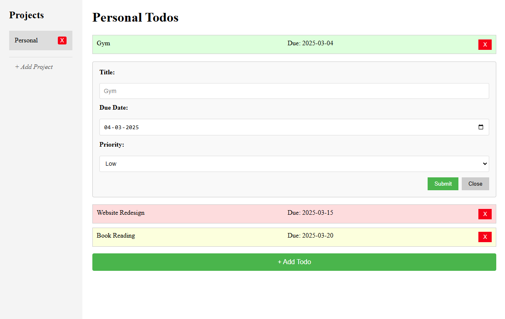
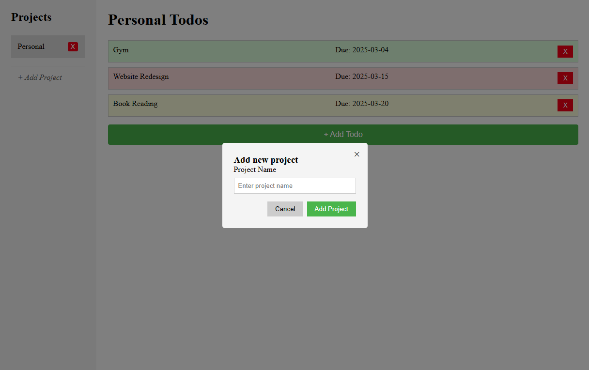
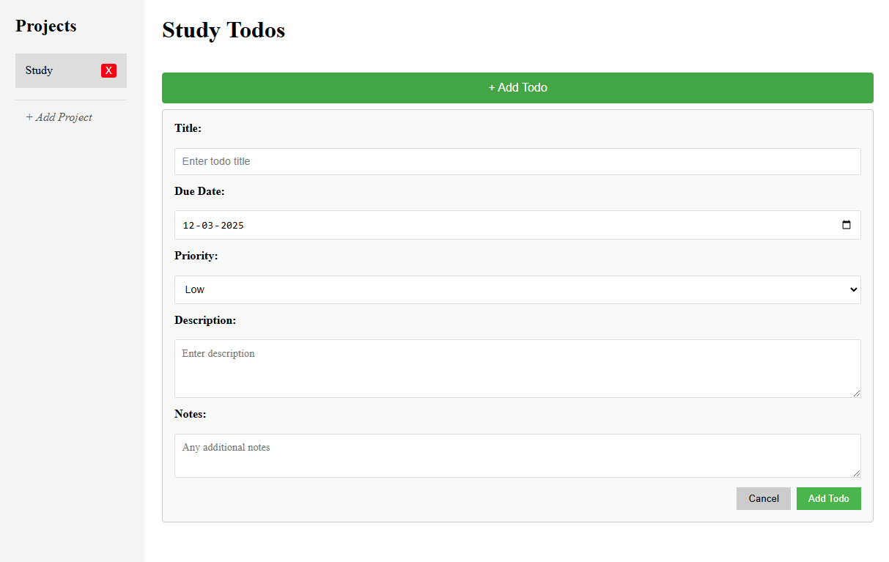

# 📌 Todo App

A minimal yet powerful Todo App that allows you to create projects, manage tasks, and track priorities. Built with **vanilla JavaScript**, **Webpack**, and **localStorage** for persistent task management.


---

## 🚀 Features

✅ **Create, Edit, and Delete Todos** – Manage tasks efficiently.  
✅ **Project Management** – Organize todos into multiple projects.  
✅ **Persistent Storage** – Saves tasks using **localStorage**.  
✅ **Priority-Based Styling** – Tasks have color-coded priorities (Low, Medium, High).  
✅ **Dynamic UI** – Smooth, interactive experience without page reloads.  
✅ **Fully Responsive** – Works across desktop and mobile devices.

---

## 🛠️ Tech Stack

- **JavaScript (ES6+)**
- **Webpack**
- **CSS (Flexbox & Grid)**
- **localStorage API**
- **HTML**

---

## 📸 Screenshots

### 🏠 Homepage (Default Project)



### ➕ Adding a New Project



### ➕ Adding a Todo



---

## 🔧 Installation & Setup

1. **Clone the Repository**
   ```sh
   git clone https://github.com/YOUR_GITHUB_USERNAME/todo-app.git
   cd todo-app
   ```
2. **Install Dependencies**
   ```sh
   npm install
   ```
3. **Run the App Locally**
   ```sh
   npm start
   ```
4. **Build for Production**
   ```sh
   npm run build
   ```

---

## 📂 Project Structure

```
📦 todo-app
├── 📂 src
│   ├── 📂 scripts        # JavaScript modules
│   │   ├── todo.js       # Todo-related functions
│   │   ├── sidebar.js    # Project sidebar logic
│   │   ├── state.js      # Default state of projects/todos
│   │   ├── projectState.js # Handles localStorage
│   ├── 📜 index.js       # Main entry point
│   ├── 📜 styles.css     # Styling
│   ├── 📜 template.html  # HTML template
├── 📂 screenshots        # Folder for project screenshots
├── 📜 webpack.config.js  # Webpack config
├── 📜 package.json       # Dependencies & scripts
```

---

## 🌍 Live Demo

🔗 **[Check it out on GitHub Pages](https://mn-chetan.github.io/todo/)**

---

## 🏗️ Future Improvements

- 🔄 **Drag & Drop Task Reordering**
- 🌙 **Dark Mode Support**
- 📅 **Calendar View for Due Dates**
- 🔔 **Notifications for Due Tasks**

---

## 📜 License

This project is **open-source** and available under the **MIT License**.

---

## 🤝 Contributing

Have an idea to improve this project? Feel free to submit a pull request! 💡

1. Fork the repository
2. Create a new branch: `git checkout -b feature-name`
3. Commit your changes: `git commit -m 'Add new feature'`
4. Push to the branch: `git push origin feature-name`
5. Open a Pull Request

---

## 🎯 Acknowledgments

Built as part of [The Odin Project](https://www.theodinproject.com/) curriculum. 🚀

---

### 📩 Contact

For any questions, feel free to reach out! 😊  
💼 LinkedIn: [Chetan M N](https://www.linkedin.com/in/chetan-m-n/)
